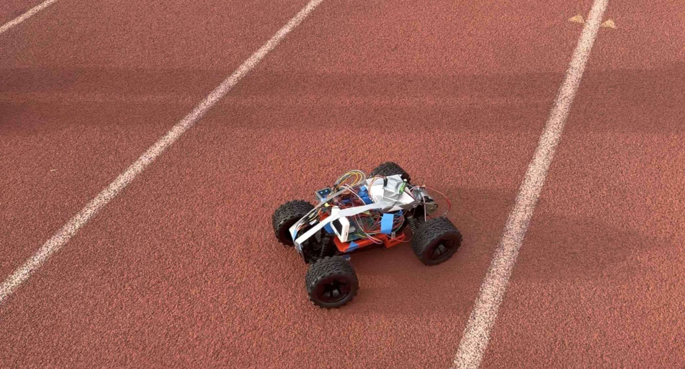
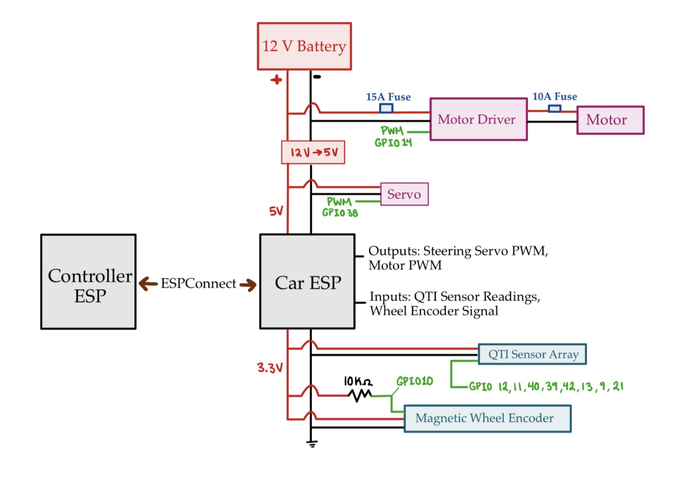

# Smart Pace-Setter Line-Following Car





An autonomous IoT-enabled RC car that follows a running-track lane while maintaining a user-selected pace. The system combines embedded sensing, closed-loop motor and steering control, wireless communication, and a proof-of-concept cloud data-logging pipeline.

The project was developed for ECE 655 by **Flaviana Keller**, **Brandon Ramirez**, and **Neyla Kirby**.

## Project Overview

The Smart Pace-Setter is designed to serve as an autonomous running companion. A user selects a target pace in minutes and seconds per mile using a touchscreen controller, starts the vehicle, and runs alongside it while the car follows a track lane at the selected speed.

The system is divided into two ESP32-based subsystems:

- **Controller ESP** — provides the touchscreen user interface and sends pace, start, and stop commands.
- **Car ESP** — controls the vehicle, processes the QTI sensor array and wheel encoder, regulates speed, and actuates the steering servo and motor driver.

The two microcontrollers communicate directly using **ESP-NOW**, allowing low-latency communication without requiring an external Wi-Fi network or router.

## System Architecture



The car uses two protoboards:

- **Logic protoboard:** connects the sensors and actuators to the Car ESP GPIO pins.
- **Power protoboard:** distributes battery power and steps the battery voltage down for the low-voltage electronics.

## Features

- Autonomous line following using an 8-channel Parallax QTI reflectance sensor array
- Weighted sensor-error calculation to estimate the line position relative to the vehicle
- PWM-controlled servo steering
- Steering low-pass filtering to reduce jitter caused by sensor noise
- Last-command retention when the line is temporarily lost
- Closed-loop speed regulation using a magnetic wheel encoder
- PI speed controller with integral reset, output limiting, and anti-windup behavior
- Gradual speed ramping during startup and faster ramp-down during stopping
- Touchscreen pace selection in minutes per mile and seconds per mile
- Wireless start, stop, and pace commands using ESP-NOW
- HTTP POST data logging proof of concept using a Flask and PostgreSQL backend
- Real-time execution using ESP-IDF and FreeRTOS

## Hardware

- ESP32-S3 microcontroller for the car subsystem
- ESP32 controller unit with touchscreen interface
- Parallax 8-channel QTI sensor array
- 12 V RS-550 DC motor
- BTS7960 / IBT-2 43 A motor driver
- Steering servo and front steering assembly
- Hall-effect magnetic wheel encoder
- Magnet mounted to a rear wheel axle
- Zeee 3S 5200 mAh 11.1 V LiPo battery
- ZK-4KX buck converter
- Fuses for protection against excessive current during stalls
- RC chassis, gearbox, wheels, and custom mechanical components

## Control Systems

### Line Following

The QTI array is mounted approximately one inch above the track surface. Each sensor produces a binary light/dark reading based on reflected infrared light. The sensors are assigned position weights ranging from **-350** for the leftmost sensor to **+350** for the rightmost sensor.

The Car ESP calculates a weighted average of the active sensors to estimate the line's position relative to the center of the car. This error is converted into a PWM command for the steering servo. A negative error steers in one direction, while a positive error steers in the other.

To improve stability, the steering output uses a weighted average that retains approximately **75% of the previous command** and incorporates **25% of the newly calculated command**. If no sensor detects the line, the car retains its previous steering command in an attempt to reacquire the track.

### Pace Regulation

The user-selected pace is converted from minutes per mile into meters per second. The vehicle speed is estimated from a magnetic wheel encoder connected to a GPIO interrupt.

The encoder produces eight signal transitions per wheel revolution. With a wheel diameter of approximately **0.115 m**, each encoder count represents roughly **0.045 m** of travel. Although the main control loop runs every **20 ms**, speed is estimated over a **100 ms window** and low-pass filtered to reduce the measurement jumps caused by discrete encoder pulses.

The PI controller compares the ramped target speed with the filtered measured speed:

- The proportional term responds to the current speed error.
- The integral term reduces steady-state error.
- The integral is reset when the target speed reaches zero.
- Anti-windup logic prevents the integral term from pushing the controller further into saturation.
- The output is currently limited to **60% PWM** as a safety measure to reduce current draw and protect the motor driver and fuses.

Before the physical encoder and motor driver were available, a waveform generator was used to simulate encoder pulses at different frequencies. This allowed the encoder-counting logic, speed calculation, filtering, and PI response to be tested independently.

## Power Architecture

The 3S LiPo battery supplies the primary high-voltage rail to the motor driver and RS-550 motor. A buck converter steps the battery voltage down to approximately **5 V** for the ESP32, steering servo, and motor-driver logic. The ESP32's **3.3 V** output powers the QTI sensor array and magnetic encoder.

## Software Stack

### Embedded Software

- ESP-IDF 5.x
- FreeRTOS
- ESP-NOW
- `esp_http_client`
- LEDC PWM control
- GPIO interrupts for encoder feedback
- LVGL for the optional touchscreen user interface

### Backend

- Python Flask server
- PostgreSQL database
- `psycopg2`
- AWS EC2 hosting for the proof-of-concept server

## Data Logging

The project includes a proof-of-concept cloud logging pipeline. At the end of a run, the controller can package the start time, end time, and selected pace into a JSON payload and send it to a Flask server using an HTTP POST request.

The Flask `/sensor` endpoint parses the request and stores the values in PostgreSQL. The pipeline was validated with dummy data sent from the ESP32 to the server and successfully inserted into the database. Due to mechanical reliability problems with the RC platform, consistent real-world run data was not collected.

This architecture could be extended to provide run histories, pace-over-time plots, distance summaries, average pace calculations, and performance comparisons.

## Challenges and Lessons Learned

- **Lighting sensitivity:** QTI sensor performance degraded under changing and low-light conditions. Onboard illumination or improved calibration would make line detection more robust.
- **Steering friction:** Stiff mechanical joints initially caused delayed steering response. Lubricating the front assembly improved responsiveness.
- **Sensor noise:** Raw QTI readings caused servo jitter, which was reduced using digital low-pass filtering.
- **Encoder-side wheel binding:** Mechanical asymmetry around the encoder-equipped wheel introduced friction and caused the encoder to under-report speed.
- **Control-system interaction:** Under-reported speed caused the PI controller to increase motor output, which increased mechanical stress and could lead to stalls and current spikes.
- **Power protection:** Fuses helped protect the motor driver during stall events, although they did not eliminate the underlying mechanical problem.

## Future Work

- Redesign the encoder-side wheel assembly to prevent binding and distribute mechanical loads more evenly
- Determine the highest safe operating speed and increase the speed-ramp rate
- Replace or supplement the QTI array with camera-based line detection
- Add directed lighting near the sensor array for improved low-light performance
- Improve software filtering and sensor calibration
- Fully integrate real run-data collection and visualization
- Develop a wearable IMU-based pacing system
- Improve motor-control efficiency and power management

## Getting Started

Install and configure ESP-IDF, then build the embedded project:

```bash
idf.py build
```

Flash the selected ESP32 and open the serial monitor:

```bash
idf.py -p <PORT> flash monitor
```

The project requires the appropriate ESP32 hardware, QTI sensor array, motor driver, encoder, battery, and mechanical platform for full operation. The backend components require a Flask server and PostgreSQL database configured with the expected endpoint and schema.

## Project Links

- **Repository:** [github.com/beeramn/smart-pacer](https://github.com/beeramn/smart-pacer)
- **Line-following demonstration:** [YouTube](https://youtu.be/68SktasE9x4)
- **Pace-setting demonstration:** [YouTube](https://youtu.be/XjPayK0WWog)

The line-following and pace-setting subsystems were demonstrated and tested independently.

## Contributors

- Flaviana Keller
- Brandon Ramirez
- Neyla Kirby
